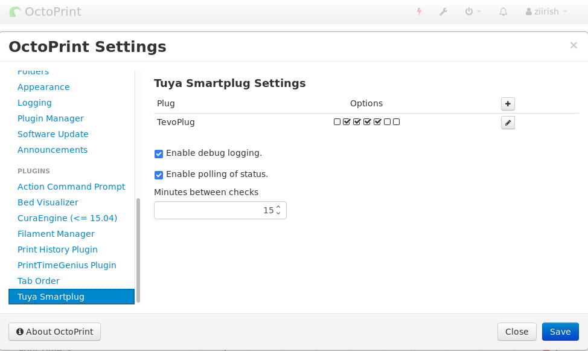

# OctoPrint-TuyaSmartplug

Work based on [OctoPrint-TPLinkSmartplug](https://github.com/jneilliii/OctoPrint-TPLinkSmartplug) and [python-tuya](https://github.com/clach04/python-tuya).
This plugin controlls [Tuya-based](https://en.tuya.com/) SmartPlugs.

##  Screenshots

## Setup

Install via the bundled [Plugin Manager](https://github.com/foosel/OctoPrint/wiki/Plugin:-Plugin-Manager)
or manually using this URL:

    https://github.com/ziirish/OctoPrint-TuyaSmartplug/archive/master.zip

## Preparatory work

In order to be able to interact with your Tuya smart plugs, you need to retrieve
both the `Device ID` and the `Local Key`. You'll find information to get those
in the [python-tuya wiki](https://github.com/clach04/python-tuya/wiki).

## Configuration

Once installed go into settings and enter the ip address for your TP-Link Smartplug device. Adjust additional settings as needed.

## Settings Explained
- **IP**
  - IP or hostname of the plug to control.
- **Label**
  - Label to use for title attribute on hover over button in navbar.
- **Icon Class**
  - Class name from [fontawesome](http://fontawesome.io/3.2.1/cheatsheet/) to use for icon on button.
- **Device ID**
  - Plug ID.
- **Local Key**
  - Local key to cypher data.
- **Warning Prompt**
  - Always warn when checked.
- **Warn While Printing**
  - Will only warn when printer is printing.
- **Use Countdown Timers**
  - Uses the plug's built in countdown timer rule to postpone the power on/off by configured delay in seconds.
- **GCODE Trigger**
  - When checked this will enable the processing of M80 and M81 commands from gcode to power on/off plug.  Syntax for gcode command is M80/M81 followed by hostname/ip.  For example if your plug is 192.168.1.2 your gcode command would be **M80 192.168.1.2**
  - You can also use the custom gcode commands `@TUYAON` and `@TUYAOFF` followed by the IP address of the plug.  This option will only work for plugs with GCODE processing enabled.  For example if your plug is 192.168.1.2 your gcode command would be **@TUYAON 192.168.1.2**
- **Auto Connect**
  - Automatically connect to printer after plug is powered on.
  - Will wait for number of seconds configured in **Auto Connect Delay** setting prior to attempting connection to printer.
- **Auto Disconnect**
  - Automatically disconnect printer prior to powering off the plug.
  - Will wait for number of seconds configured in **Auto Disconnect Delay** prior to powering off the plug.
- **Run System Command After On**
  - When checked will run system command configured in **System Command On** setting after a delay in seconds configured in **System Command On Delay**.
- **Run System Command Before Off**
  - When checked will run system command configured in **System Command Off** setting after a delay in seconds configured in **System Command Off Delay**.

## Support jneilliii Efforts
Most of the code used in this plugin has been written by
[jneilliii](https://github.com/jneilliii) so if you want to support someone,
you can support his work.
